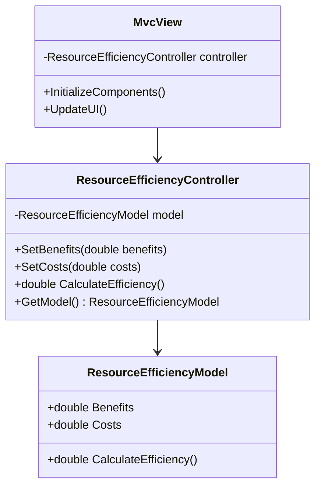
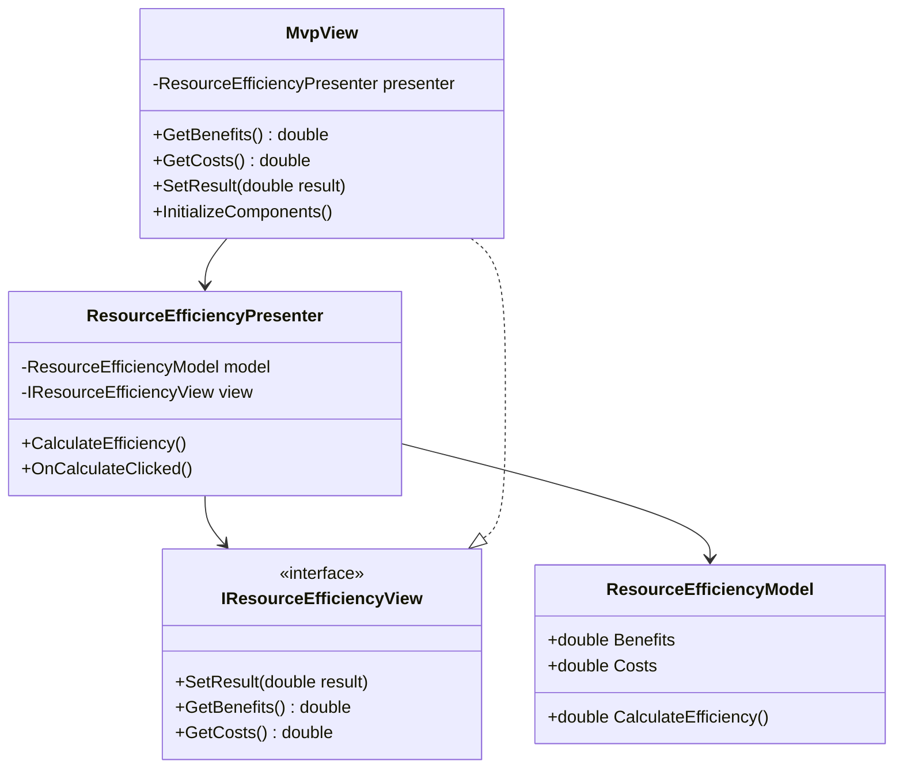
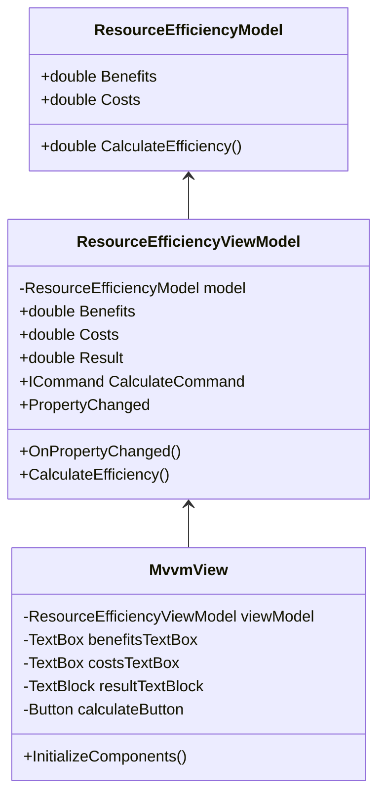

## Виконав: Русанов Данііл
### Завдання #23: Розрахунок коефіцієнта ефективності використання ресурсів у проекті:
#### MVC

```mermaid
classDiagram
    class ResourceEfficiencyModel {
        +double Benefits
        +double Costs
        +double CalculateEfficiency()
    }

    class ResourceEfficiencyController {
        -ResourceEfficiencyModel model
        +SetBenefits(double benefits)
        +SetCosts(double costs)
        +double CalculateEfficiency()
        +GetModel() ResourceEfficiencyModel
    }

    class MvcView {
        -ResourceEfficiencyController controller
        +InitializeComponents()
        +UpdateUI()
    }

    ResourceEfficiencyController --> ResourceEfficiencyModel
    MvcView --> ResourceEfficiencyController

```

#### MVP

```mermaid
classDiagram
    class ResourceEfficiencyModel {
        +double Benefits
        +double Costs
        +double CalculateEfficiency()
    }

    class IResourceEfficiencyView {
        <<interface>>
        +SetResult(double result)
        +GetBenefits() double
        +GetCosts() double
    }

    class ResourceEfficiencyPresenter {
        -ResourceEfficiencyModel model
        -IResourceEfficiencyView view
        +CalculateEfficiency()
        +OnCalculateClicked()
    }

    class MvpView {
        -ResourceEfficiencyPresenter presenter
        +GetBenefits() double
        +GetCosts() double
        +SetResult(double result)
        +InitializeComponents()
    }

    ResourceEfficiencyPresenter --> ResourceEfficiencyModel
    ResourceEfficiencyPresenter --> IResourceEfficiencyView
    MvpView ..|> IResourceEfficiencyView
    MvpView --> ResourceEfficiencyPresenter

```

#### MVVM

```mermaid
classDiagram
    class ResourceEfficiencyModel {
        +double Benefits
        +double Costs
        +double CalculateEfficiency()
    }

    class ResourceEfficiencyViewModel {
        -ResourceEfficiencyModel model
        +double Benefits
        +double Costs
        +double Result
        +ICommand CalculateCommand
        +PropertyChanged
        +OnPropertyChanged()
        +CalculateEfficiency()
    }

    class MvvmView {
        -ResourceEfficiencyViewModel viewModel
        -TextBox benefitsTextBox
        -TextBox costsTextBox
        -TextBlock resultTextBlock
        -Button calculateButton
        +InitializeComponents()
    }

    ResourceEfficiencyModel <-- ResourceEfficiencyViewModel
    ResourceEfficiencyViewModel <-- MvvmView
```